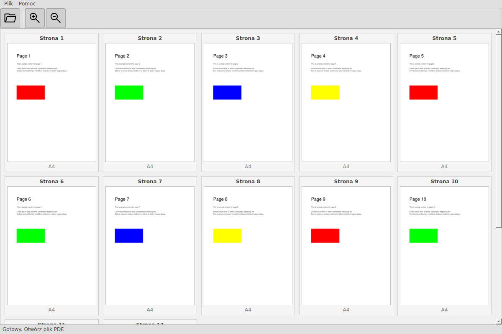

# GRYF PDF Viewer (Qt Edition)

## Opis

PDFViewerQt.py to uproszczona przeglądarka dokumentów PDF stworzona w PySide6. Aplikacja jest przeznaczona wyłącznie do przeglądania plików PDF i prezentowania ich w formie siatki miniaturek.

## Funkcjonalność

### Zaimplementowane funkcje:
- ✅ **Otwieranie plików PDF** - dialog wyboru pliku
- ✅ **Wyświetlanie miniaturek w siatce** - automatyczny układ grid
- ✅ **Automatyczne dopasowanie kolumn** - dynamiczne dostosowanie do szerokości okna
- ✅ **Powiększanie/pomniejszanie miniaturek** - przyciski zoom in/out
- ✅ **Pasek menu** - Plik, Pomoc
- ✅ **Pasek narzędzi** - ikony akcji
- ✅ **Pasek statusu** - informacje o aktualnym stanie
- ✅ **Rozpoznawanie formatów stron** - A4, A3, Letter, itp.
- ✅ **Jasna kolorystyka** - zgodna z oryginalnym GUI w Tkinter

### Technologie:
- **PySide6** - framework GUI (Qt dla Pythona)
- **PyMuPDF (fitz)** - renderowanie stron PDF
- **Pillow (PIL)** - przetwarzanie obrazów

## Wymagania

```bash
pip install PySide6 PyMuPDF Pillow
```

## Uruchomienie

```bash
python3 PDFViewerQt.py
```

Lub bezpośrednio:

```bash
chmod +x PDFViewerQt.py
./PDFViewerQt.py
```

## Zrzuty ekranu

Aplikacja prezentuje pliki PDF w przejrzystej siatce miniaturek:



## Architektura

### Główne klasy:

1. **PDFViewerMainWindow** - główne okno aplikacji
   - Menu i pasek narzędzi
   - Obsługa akcji (otwórz, zamknij, zoom)
   - Pasek statusu

2. **PDFViewerWidget** - widget z siatką miniaturek
   - Zarządzanie dokumentem PDF
   - Renderowanie miniaturek
   - Dynamiczny układ grid
   - Obsługa resize z debouncing

3. **ThumbnailWidget** - widget pojedynczej miniatury
   - Wyświetlanie obrazu strony
   - Numer strony
   - Format strony (A4, A3, itp.)

## Różnice w stosunku do PDFEditor.py

### Uproszczenia:
- ❌ Brak funkcji edycji PDF
- ❌ Brak zaznaczania stron
- ❌ Brak narzędzi do obracania, kadrowania, numeracji
- ❌ Brak operacji kopiuj/wklej
- ❌ Brak eksportu

### Zalety nowego rozwiązania:
- ✅ Nowoczesny framework Qt
- ✅ Lepsza integracja z systemem
- ✅ Spójny wygląd na różnych platformach
- ✅ Kod łatwiejszy w rozwoju (obiektowy model Qt)
- ✅ Niezależność od Tkinter

## Kolorystyka

Aplikacja używa jasnej palety kolorów zgodnej z oryginałem:

- **Tło główne**: #F0F0F0
- **Tło paneli**: #E0E0E0
- **Tło miniaturek**: #F5F5F5
- **Tekst**: #444444
- **Ramki**: #D0D0D0, #C0C0C0

## Ikony

Aplikacja wykorzystuje te same ikony co oryginalna wersja (katalog `icons/`):
- `gryf.ico` - ikona aplikacji
- `open.png` - otwórz plik
- `zoom_in.png` - powiększ
- `zoom_out.png` - pomniejsz

## Licencja

Program stanowi wyłączną własność intelektualną Centrum Graficznego Gryf sp. z o.o.

Wszelkie prawa zastrzeżone. Kopiowanie, modyfikowanie oraz rozpowszechnianie programu bez pisemnej zgody autora jest zabronione.

## Autor

© Centrum Graficzne GRYF sp. z o.o.
